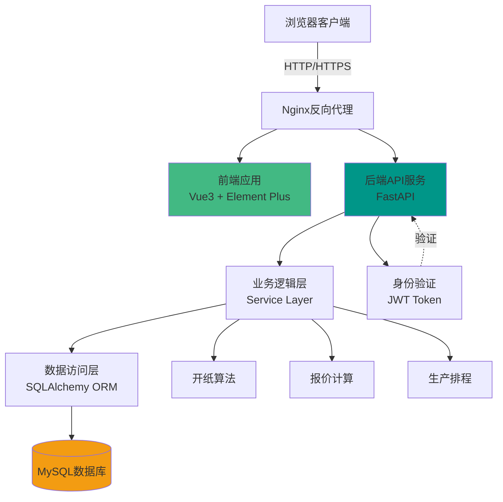
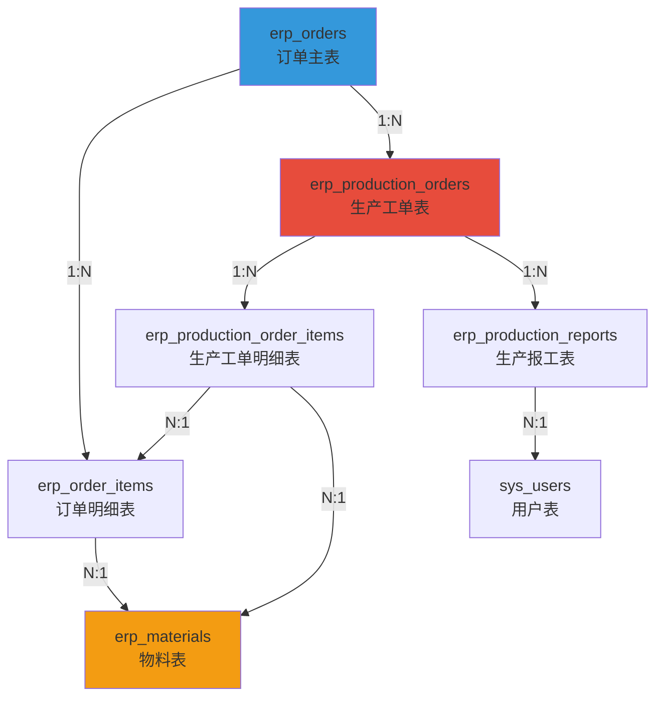
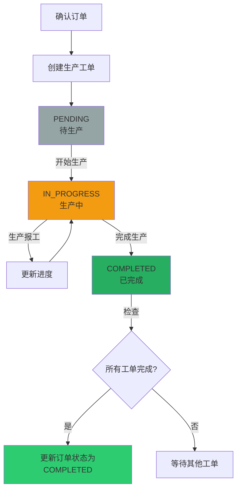
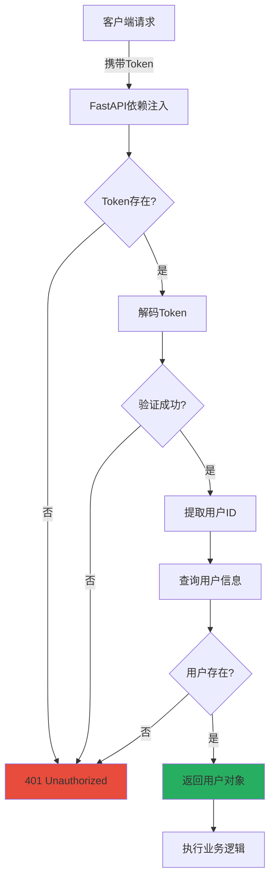

# 印刷企业ERP系统的设计与实现

## 摘要

本文设计并实现了一套面向印刷行业的企业资源计划（ERP）系统。系统采用FastAPI和Vue.js前后端分离架构，实现了订单管理、生产排程、物料管理等核心功能。通过RESTful API设计、SQLAlchemy ORM技术和JWT认证机制，构建了高效、安全的业务处理流程。系统针对印刷行业的特殊需求，如开纸算法、工艺管理、生产报工等进行了专门优化，有效提升了印刷企业的生产管理效率。

**关键词**：印刷ERP；FastAPI；Vue.js；生产排程；订单管理

---

## 1. 系统概述

印刷企业生产流程复杂，涉及订单接收、报价计算、物料准备、生产排程、工艺控制等多个环节。传统管理方式存在信息传递效率低、生产进度难以实时掌控、物料消耗计算不准确等问题。

本系统主要包含以下核心功能模块：**用户认证与权限管理**（JWT身份验证）、**订单管理**（订单创建、状态流转）、**生产排程**（工单生成、任务分配、进度跟踪）、**物料管理**（纸张等原材料维护）、**报价计算**（开纸算法、成本计算）、**生产报工**（实时进度反馈）。

系统特点：专为印刷行业设计，支持P数计算、开纸方案等专业功能；采用前后端分离架构，便于扩展；使用关系型数据库确保数据一致性；订单和工单采用状态机管理，确保流程规范。

---

## 2. 系统架构设计

### 2.1 技术选型

系统采用前后端分离架构，后端使用**FastAPI**（Python高性能异步框架）+ **SQLAlchemy 2.0**（ORM）+ **MySQL**（数据库）+ **Alembic**（数据库迁移），前端使用**Vue 3** + **Element Plus** + **Pinia**（状态管理）+ **Vite**（构建工具）。

### 2.2 系统架构

系统采用三层架构设计：表现层（Vue前端）、API层（FastAPI）、业务逻辑层（Service）、数据访问层（ORM）、数据存储层（MySQL）。



### 2.3 数据库设计

系统核心数据表及关系：



**核心表说明**：
- **erp_orders**：订单主表，存储订单号（SO+YYYYMMDD+001）、客户信息、订单状态
- **erp_order_items**：订单明细，存储产品规格（成品尺寸、页数）、工艺信息（JSON）、开纸方案
- **erp_production_orders**：生产工单主表，存储工单号（PO+YYYYMMDD+001）、计划时间、实际时间、优先级
- **erp_production_order_items**：生产工单明细，记录计划数量、完成数量、报废数量
- **erp_production_reports**：生产报工记录，支持START/PROGRESS/COMPLETE/REJECT四种类型

---

## 3. 核心功能实现

### 3.1 订单管理模块

#### 订单状态流转

订单采用状态机模式管理生命周期：


**状态说明**：DRAFT（订单初始状态，可编辑）→ CONFIRMED（订单确认，可创建工单）→ PRODUCTION（已下发生产）→ COMPLETED（所有工单完成）。

#### 数据模型设计

**订单主表（Order）** - `backend/app/models/order.py:22`：
```python
class Order(Base):
    __tablename__ = "erp_orders"
    id: Mapped[int] = mapped_column(primary_key=True)
    order_no: Mapped[str] = mapped_column(String(30), unique=True)  # SO+YYYYMMDD+001
    customer_name: Mapped[str] = mapped_column(String(100))
    status: Mapped[OrderStatus] = mapped_column(SQLEnum(OrderStatus))
    items: Mapped[List["OrderItem"]] = relationship(cascade="all, delete-orphan")
```

**订单明细表（OrderItem）**：存储产品名称、印数、成品尺寸（宽/高mm）、页数、纸张物料ID、工艺信息（JSON）、开纸方案（DIRECT/ROTATED）。

#### 订单编号生成算法

```python
async def generate_order_no(db: AsyncSession) -> str:
    """生成订单编号: SO+YYYYMMDD+001"""
    today_str = datetime.now().strftime("%Y%m%d")
    prefix = f"SO{today_str}"
    # 查询今日最大序号并+1
    last_no = await db.scalar(
        select(Order.order_no).where(Order.order_no.like(f"{prefix}%"))
        .order_by(Order.order_no.desc())
    )
    seq = int(last_no[-3:]) + 1 if last_no else 1
    return f"{prefix}{seq:03d}"
```

### 3.2 生产排程模块

#### 生产工单流程



#### 创建生产工单核心逻辑

`backend/app/services/production_service.py:41`：

**流程**：
1. 验证订单状态为CONFIRMED，否则抛出异常
2. 生成工单号（PO+YYYYMMDD+序号，逻辑同订单编号）
3. 创建生产工单主记录（状态为PENDING）
4. 复制订单明细到生产工单明细（产品名称、计划数量、尺寸、纸张用量等）
5. 更新订单状态为PRODUCTION
6. 事务提交，确保数据一致性

**关键代码片段**：
```python
async def create_production_order(db: AsyncSession, data: ProductionOrderCreate):
    # 1. 检查订单状态
    order = await db.execute(
        select(Order).where(Order.id == data.order_id)
        .options(selectinload(Order.items))  # 预加载明细，避免N+1查询
    )
    if order.status != OrderStatus.CONFIRMED:
        raise ValueError("只能对已确认的订单创建生产工单")

    # 2-4. 创建工单并复制明细
    production_order = ProductionOrder(
        production_no=await generate_production_no(db),
        order_id=data.order_id,
        status=ProductionStatus.PENDING
    )
    db.add(production_order)
    await db.flush()  # 获取自增ID

    for order_item in order.items:
        production_item = ProductionOrderItem(
            production_order_id=production_order.id,
            order_item_id=order_item.id,
            plan_quantity=order_item.quantity
        )
        db.add(production_item)

    # 5. 更新订单状态
    order.status = OrderStatus.PRODUCTION
    await db.commit()
```

#### 生产报工机制

**报工类型**：START（开工）、PROGRESS（进度）、COMPLETE（完工）、REJECT（报废）

**报工处理**：创建报工记录 → 更新生产明细的完成数量/报废数量 → 返回报工结果。报工数据用于统计生产进度和完成率。

### 3.3 用户认证与权限管理

#### JWT认证流程



**JWT Token生成** - `backend/app/core/security.py:26`：
```python
def create_access_token(data: dict, expires_delta: Optional[timedelta] = None):
    """创建JWT令牌，载荷包含用户ID，默认30分钟过期"""
    to_encode = data.copy()
    expire = datetime.utcnow() + (expires_delta or timedelta(minutes=30))
    to_encode.update({"exp": expire})
    return jwt.encode(to_encode, settings.SECRET_KEY, algorithm="HS256")
```

**密码安全**：使用bcrypt算法哈希存储密码，验证时使用`bcrypt.checkpw()`比对。

---

## 4. 关键技术方案

### 4.1 异步编程

FastAPI支持异步I/O，使用AsyncSession进行数据库操作：

```python
from sqlalchemy.ext.asyncio import AsyncSession, create_async_engine

# 创建异步引擎
engine = create_async_engine(settings.DATABASE_URL)

# API端点异步处理
@router.get("/orders/")
async def get_orders(db: AsyncSession = Depends(get_db)):
    result = await db.execute(select(Order))
    return result.scalars().all()
```

### 4.2 数据验证与序列化

使用Pydantic进行请求验证和响应序列化：

```python
class ProductionOrderCreate(BaseModel):
    order_id: int = Field(..., description="关联订单ID")
    priority: int = Field(5, ge=1, le=10, description="优先级1-10")
    plan_start_date: Optional[datetime] = None
```

**优势**：自动验证数据类型和范围、自动生成OpenAPI文档、支持类型提示。

### 4.3 数据库迁移

使用Alembic管理数据库版本：

```bash
# 生成迁移脚本
poetry run alembic revision --autogenerate -m "create orders table"

# 执行迁移
poetry run alembic upgrade head
```

### 4.4 前端状态管理

使用Pinia管理全局状态（用户Token、用户信息），Axios拦截器统一添加Token和处理401错误。

### 4.5 技术栈对比

| 技术领域 | 选型 | 替代方案 | 选择理由 |
|---------|------|---------|---------|
| 后端框架 | FastAPI | Flask/Django | 高性能、异步、自动文档 |
| ORM | SQLAlchemy 2.0 | Tortoise ORM | 成熟稳定、类型安全 |
| 前端框架 | Vue 3 | React | 渐进式、易学习 |
| UI库 | Element Plus | Ant Design Vue | Vue 3适配好 |
| 数据库 | MySQL | PostgreSQL | 通用性强 |

---

## 5. 系统测试与部署

### 5.1 API测试

FastAPI自动生成Swagger文档（`http://localhost:8000/docs`），可直接在线测试API。

**测试流程**：登录获取Token → 在Swagger UI授权 → 测试各API端点。

### 5.2 开发环境

**后端启动**：
```bash
cd backend
poetry install          # 安装依赖
poetry run alembic upgrade head  # 数据库迁移
poetry run uvicorn app.main:app --reload  # 启动服务
```

**前端启动**：
```bash
cd frontend
npm install
npm run dev
```

### 5.3 生产部署

**部署架构**：

```mermaid
flowchart LR
    A[用户] --> B[Nginx<br/>80/443]
    B -->|静态资源| C[前端静态文件<br/>Dist]
    B -->|API请求| D[Gunicorn<br/>多进程]
    D --> E[FastAPI<br/>应用实例]
    E --> F[(MySQL<br/>数据库)]

    style B fill:#2c3e50
    style D fill:#e67e22
    style F fill:#e74c3c
```



**核心配置**：
- **Nginx**：反向代理API请求到后端，直接提供前端静态文件
- **Gunicorn**：多进程管理FastAPI应用（4个worker，使用UvicornWorker）
- **Systemd**：将服务注册为系统服务，实现开机自启和自动重启

---

## 6. 总结与展望

### 6.1 系统总结

本文设计并实现了印刷行业ERP系统，完成了以下工作：

**系统架构**：采用前后端分离架构，基于FastAPI + Vue 3构建高性能Web应用。

**核心功能**：实现了订单管理的完整生命周期（草稿→确认→生产→完成）、生产排程（工单创建、任务分配、进度跟踪、报工管理）、基于JWT的身份认证和权限控制。

**技术方案**：使用SQLAlchemy 2.0 ORM实现类型安全的数据库操作、Pydantic进行数据验证、Alembic管理数据库迁移、异步编程提升并发性能。

**业务价值**：规范了订单管理流程，减少人工错误；实现了生产进度实时跟踪和统计；提高了数据准确性和管理效率。

### 6.2 系统不足

1. **功能覆盖有限**：库存管理、财务管理、客户关系管理等模块尚未开发
2. **缺少数据可视化**：报表功能和数据大屏尚未实现
3. **移动端支持不足**：前端未适配移动设备
4. **性能优化空间**：缓存机制、查询优化有待完善

### 6.3 未来展望

**功能扩展**：
- **库存管理**：原材料入库、出库、盘点、库存预警
- **财务管理**：应收款管理、成本核算、利润分析
- **客户管理**：客户信息维护、历史订单查询、客户画像

**智能化升级**：
- **智能排产**：基于机器学习优化生产排程，考虑设备负载和交货期
- **需求预测**：分析历史数据预测客户需求，辅助备料决策

**技术优化**：
- **缓存系统**：引入Redis缓存热点数据，提升查询性能
- **消息队列**：使用RabbitMQ处理异步任务（报表生成、邮件通知）
- **数据可视化**：集成ECharts实现数据大屏和可视化报表
- **微服务改造**：业务规模扩大后拆分为独立服务

**移动端与集成**：
- 开发微信小程序或App，支持移动报工和订单查询
- 对接IoT设备，实时采集生产数据
- 集成第三方系统（财务软件、物流系统）

通过持续迭代优化，本系统将成长为功能完善的印刷行业ERP解决方案，为企业数字化转型提供有力支撑。

---

## 参考文献

[1] FastAPI官方文档. https://fastapi.tiangolo.com/

[2] Vue.js官方文档. https://vuejs.org/

[3] SQLAlchemy官方文档. https://docs.sqlalchemy.org/

[4] Pydantic官方文档. https://docs.pydantic.dev/

[5] Element Plus官方文档. https://element-plus.org/

---

**项目信息**：
- **项目名称**：Print-ERP System
- **版本**：v1.0.0
- **技术栈**：FastAPI + Vue 3 + MySQL
- **完成时间**：2025年12月
